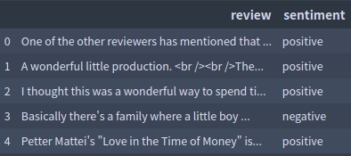
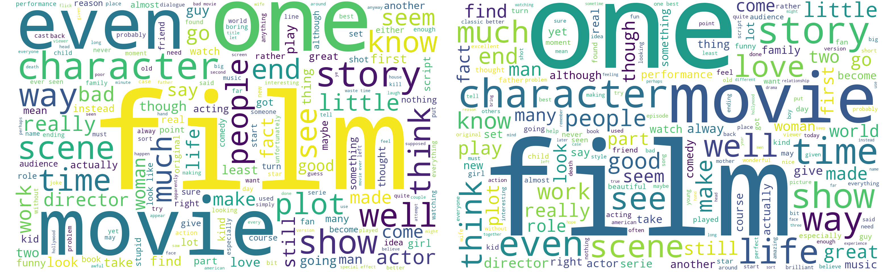

[TOC]

# IMDB-Text-Classification

Machine Learning and Deep Learning methods on IMDB datasets

## 数据集

数据集来源为 Kaggle 上 IMDB 影评数据，下载地址[在此](https://www.kaggle.com/lakshmi25npathi/imdb-dataset-of-50k-movie-reviews/data)

数据集格式如下



数据集包含电影的影评以及影评对应的两类情感标签。该任务为情感分析任务，判断影评是正面（positive）还是负面（negative）。数据集一共有 50000 条数据，其中 25000 条正面评价，25000 条负面评价，总的类别分布平衡。

## 数据清洗

一般英文文本的清洗，有一下几个步骤：

- 除去数据中非文本部分（html 标签、非英文字符 (non-alpha)）
- 拼写检查更正
- 转化为小写
- 分词
- 去停用词
- 词干提取 (stemming) 和词形还原 (lemmatization)

> 详细信息参考[英文文本挖掘预处理流程总结](https://www.cnblogs.com/pinard/p/6756534.html)

```
"One of the other reviewers has mentioned that after watching just 1 Oz episode you'll be hooked. They are right, as this is exactly what happened with me.<br /><br />The first thing that struck me about Oz was its brutality and unflinching scenes of violence, which set in right from the word GO. Trust me, this is not a show for the faint hearted or timid. This show pulls no punches with regards to drugs, sex or violence. Its is hardcore, in the classic use of the word.<br /><br />It is called OZ as that is the nickname given to the Oswald Maximum Security State Penitentary. It focuses mainly on Emerald City, an experimental section of the prison where all the cells have glass fronts and face inwards, so privacy is not high on the agenda. Em City is home to many..Aryans, Muslims, gangstas, Latinos, Christians, Italians, Irish and more....so scuffles, death stares, dodgy dealings and shady agreements are never far away.<br /><br />I would say the main appeal of the show is due to the fact that it goes where other shows wouldn't dare. Forget pretty pictures painted for mainstream audiences, forget charm, forget romance...OZ doesn't mess around. The first episode I ever saw struck me as so nasty it was surreal, I couldn't say I was ready for it, but as I watched more, I developed a taste for Oz, and got accustomed to the high levels of graphic violence. Not just violence, but injustice (crooked guards who'll be sold out for a nickel, inmates who'll kill on order and get away with it, well mannered, middle class inmates being turned into prison bitches due to their lack of street skills or prison experience) Watching Oz, you may become comfortable with what is uncomfortable viewing....thats if you can get in touch with your darker side."
```

以上为第一条影评，考虑以上步骤。影评数据拼写错误应该很少，因此不进行处理。其他处理方法如下

```python
def clean_data(data):
    '''
    对影评进行……处理
    输入：DataFrame 包含影评和情感类别
    输出：DataFrame 包含处理后的影评和数字化后类别
    '''
    # positive 用 1 替换，negative 用 0 替换
    data['sentiment'][data['sentiment']=='positive'] = 1
    data['sentiment'][data['sentiment']=='negative'] = 0

    for i, text in enumerate(tqdm(data['review'])):
        text = text.replace("<br />", " ") # 替换<br />标签
        lower = text.lower() # 全部转化为小写
        tokens = nltk.word_tokenize(lower) # 分词
        without_stopwords = [word for word in tokens if not word in stopwords.words('english')] # 去停用词
        no_alpha = [word for word in without_stopwords if word.isalpha()]
        wn = nltk.WordNetLemmatizer()
        lemm_text = [wn.lemmatize(word) for word in no_alpha] # 词形还原
        data['review'][i] = lemm_text
    
    return data
```

清洗后的数据如下所示

```
['one', 'reviewer', 'mentioned', 'watching', 'oz', 'episode', 'hooked', 'right', 'exactly', 'happened', 'first', 'thing', 'struck', 'oz', 'brutality', 'unflinching', 'scene', 'violence', 'set', 'right', 'word', 'go', 'trust', 'show', 'faint', 'hearted', 'timid', 'show', 'pull', 'punch', 'regard', 'drug', 'sex', 'violence', 'hardcore', 'classic', 'use', 'word', 'called', 'oz', 'nickname', 'given', 'oswald', 'maximum', 'security', 'state', 'penitentary', 'focus', 'mainly', 'emerald', 'city', 'experimental', 'section', 'prison', 'cell', 'glass', 'front', 'face', 'inwards', 'privacy', 'high', 'agenda', 'em', 'city', 'home', 'many', 'aryan', 'muslim', 'gangsta', 'latino', 'christian', 'italian', 'irish', 'scuffle', 'death', 'stare', 'dodgy', 'dealing', 'shady', 'agreement', 'never', 'far', 'away', 'would', 'say', 'main', 'appeal', 'show', 'due', 'fact', 'go', 'show', 'would', 'dare', 'forget', 'pretty', 'picture', 'painted', 'mainstream', 'audience', 'forget', 'charm', 'forget', 'romance', 'oz', 'mess', 'around', 'first', 'episode', 'ever', 'saw', 'struck', 'nasty', 'surreal', 'could', 'say', 'ready', 'watched', 'developed', 'taste', 'oz', 'got', 'accustomed', 'high', 'level', 'graphic', 'violence', 'violence', 'injustice', 'crooked', 'guard', 'sold', 'nickel', 'inmate', 'kill', 'order', 'get', 'away', 'well', 'mannered', 'middle', 'class', 'inmate', 'turned', 'prison', 'bitch', 'due', 'lack', 'street', 'skill', 'prison', 'experience', 'watching', 'oz', 'may', 'become', 'comfortable', 'uncomfortable', 'viewing', 'thats', 'get', 'touch', 'darker', 'side']
```

对于清洗后的数据，绘制词云查看 negative 和 positive  词云



左边为 negative 词云，右边为 positive 词云。出现最多的还是 film、one、movie 等名词，但是也可以看出左边出现 bad、little，右边出现 good、great、love 等词。

对两类数据去除名词后再次查看词云